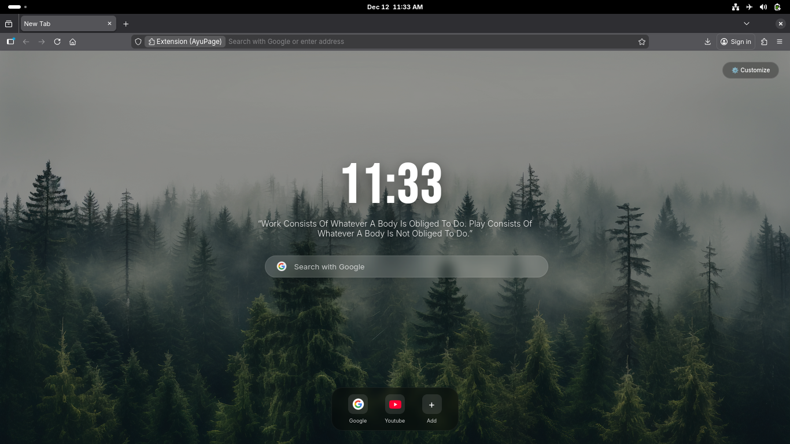

# AyuPage - Custom Browser Dashboard

A minimal, fast, and highly customizable "New Tab" page for modern browsers. Built with vanilla JavaScript, HTML5, and CSS3.

## Features
- **Customizable Backgrounds:** Choose from built-in 4K wallpapers (Nature, Space, Aurora) or upload your own.
- **Smart Clock:** 12h/24h toggle, seconds display, and professional font selection.
- **Productivity Tools:** Quick Search (Google, DuckDuckGo, etc.) and a Shortcuts Dock.
- **Daily Inspiration:** Fetches a new motivational quote automatically.
- **Privacy Focused:** All settings are stored locally. No tracking.

## Installation
1. Download the latest release.
2. Go to `chrome://extensions` or `about:debugging`.
3. Enable "Developer Mode".
4. Load the unpacked extension folder.

## Tech Stack
- HTML5 / CSS3 (Flexbox & Grid)
- Vanilla JavaScript (ES6+)
- LocalStorage API
- Google Favicon API & DummyJSON API

## License
MIT License